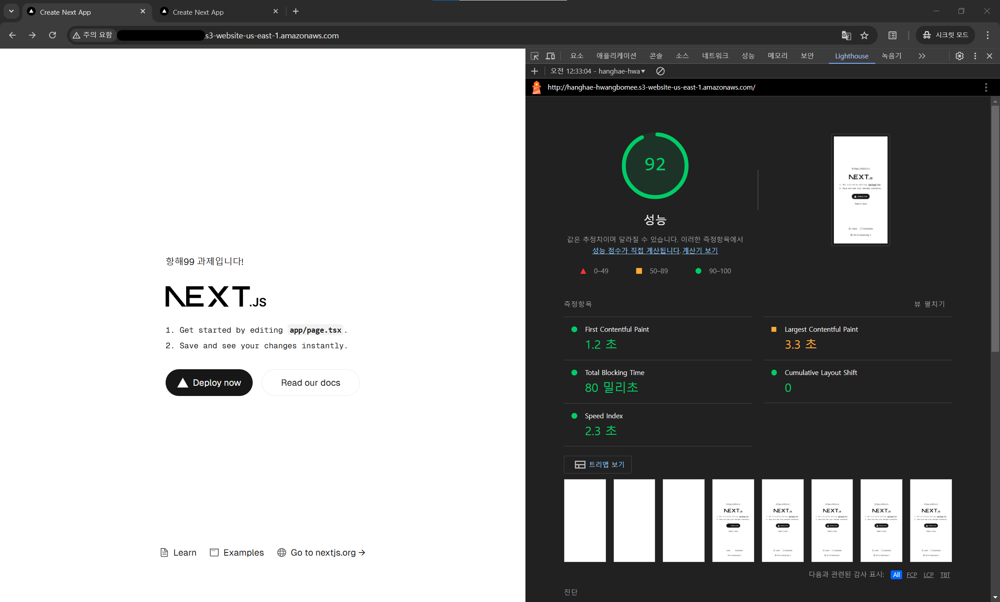
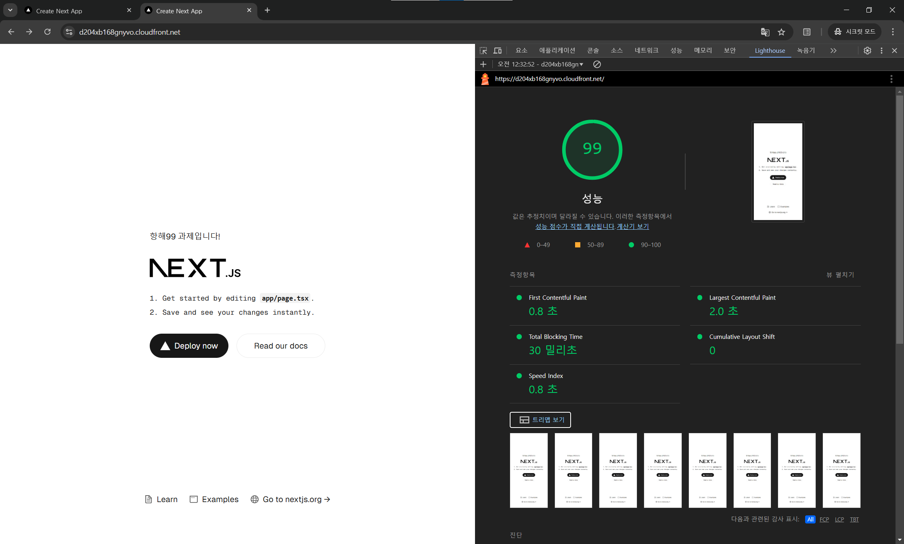

# 인프라 레벨 최적화 실습

   
  
   
   

인프라 레벨 최적화를 실습해보는 항해 프론트엔드 3기 9주차 과제용 레포지토리입니다.

프론트엔드 프로젝트의 배포 프로세스를 이해하고, 인프라 최적화 기법(CDN)을 적용하여 성능을 개선합니다.

## 목차

1. [프론트엔드 프로젝트 배포 프로세스](#프론트엔드-프로젝트-배포-프로세스)
   - [배포 전 AWS 설정](#배포-전-aws-설정)
   - [Github Actions에 워크플로우 작성해 배포 진행](#github-actions에-워크플로우-작성해-배포-진행)
   - [주요 개념](#주요-개념)
2. [CDN 도입 전과 도입 후의 성능 개선 보고서](#cdn-도입-전과-도입-후의-성능-개선-보고서)
   - [개요](#1-개요)
   - [테스트 환경](#2-테스트-환경)
   - [성능 지표](#3-성능-지표)
   - [성능 비교](#4-성능-비교)
   - [분석](#5-분석)
   - [결론](#6-결론)

---

## 프론트엔드 프로젝트 배포 프로세스

### 배포 전 AWS 설정

1. `IAM identity center` SSO 구성
2. `S3` 정적 웹사이트 호스팅용 버킷 생성, 버킷 정책 설정, CORS 구성, 정적 웹 사이트 호스팅 설정
3. `CloudFront` 배포 생성
4. `IAM` 배포 전용 사용자 생성, S3/CloudFront 접근 권한 부여

### Github Actions에 워크플로우 작성해 배포 진행

1. 레포지토리 체크아웃
2. npm 의존성 설치 (`npm ci`)
3. Next.js 애플리케이션 빌드
4. AWS 자격증명 구성
5. S3에 빌드된 파일 동기화 (`out/` 디렉토리)
6. CloudFront 캐시 무효화 (모든 경로)

### 주요 개념

GitHub Actions과 CI/CD 도구

CI/CD는 소프트웨어 개발의 핵심 파이프라인으로, 지속적 통합(Continuous Integration)과 지속적 배포(Continuous Deployment)를 의미합니다.

GitHub Actions는 이 CI/CD 과정을 자동화하는 현대적인 도구로, 코드 저장소 내에서 직접 워크플로우를 정의하고 실행할 수 있습니다.

**주요 특징:**

- 코드 푸시, 풀 리퀘스트 등 다양한 이벤트 트리거 지원
- 크로스 플랫폼 런너 제공 (Linux, macOS, Windows)
- 마켓플레이스를 통한 재사용 가능한 액션 공유
- 깃허브 생태계와의 완벽한 통합

**다른 CI/CD 도구들과 비교:**

- **Jenkins**: 고도의 커스터마이징 가능, 복잡한 설정
- **GitLab CI**: 통합된 파이프라인, 다소 폐쇄적
- **GitHub Actions**: 가장 직관적이고 확장성 높음

S3와 스토리지

스토리지는 데이터를 저장하는 모든 기술과 시스템을 의미합니다.
하드 드라이브, SSD, NAS(Network Attached Storage), 클라우드 스토리지 등 다양한 형태를 포함합니다.

**S3(Simple Storage Service)** 는 이러한 스토리지의 한 형태로, 특히 클라우드 환경에서 데이터 저장 및 관리의 유연성을 제공하는 솔루션입니다.

CloudFront와 CDN

**CDN**은 'Content Delivery Network'의 약자로, 전 세계에 분산된 서버 네트워크를 통해 사용자에게 콘텐츠를 빠르고 효율적으로 전달하는 시스템입니다.
**CloudFront**는 이러한 CDN의 한 구현체로, 웹사이트, API, 비디오 스트리밍, 소프트웨어 다운로드 등 다양한 콘텐츠를 사용자에게 신속하게 제공하는 데 최적화되어 있습니다.

- **지리적 분산**:

  CDN은 여러 지역에 위치한 엣지 서버를 통해 콘텐츠를 캐싱하고, 사용자와 가장 가까운 서버에서 콘텐츠를 제공함으로써 지연 시간을 최소화합니다. CloudFront는 전 세계에 200개 이상의 엣지 로케이션을 운영하고 있어, 사용자에게 빠른 응답 속도를 제공합니다.

- **성능 향상**:

  CloudFront는 정적 및 동적 콘텐츠를 모두 지원하며, 캐싱을 통해 서버의 부하를 줄이고, 사용자에게 더 빠른 로딩 속도를 제공합니다. 이는 웹사이트의 사용자 경험을 개선하고, SEO에도 긍정적인 영향을 미칩니다.

- **보안**:

  CloudFront는 SSL/TLS 암호화를 지원하여 데이터 전송의 보안을 강화합니다. 또한, AWS WAF(Web Application Firewall)와 통합되어 DDoS 공격 및 기타 보안 위협으로부터 보호할 수 있습니다.

- **비용 효율성**:

  CloudFront는 사용한 만큼만 비용을 지불하는 구조로, 데이터 전송량과 요청 수에 따라 요금이 부과됩니다. 이는 특히 트래픽이 변동성이 큰 애플리케이션에 유리합니다.

- **통합**:

  CloudFront는 AWS의 다른 서비스와 쉽게 통합할 수 있습니다. 예를 들어, S3와 함께 사용하여 정적 웹사이트 호스팅을 하거나, EC2와 함께 사용하여 동적 콘텐츠를 제공할 수 있습니다.

캐시 무효화(Cache Invalidation)

**캐시 무효화(Cache Invalidation)** 는 캐시된 데이터가 더 이상 유효하지 않거나 최신 상태가 아닐 때, 해당 데이터를 캐시에서 제거하거나 업데이트하는 과정을 의미합니다.

**캐시 무효화가 중요한 이유:**

1. **데이터 일관성 유지**:

   캐시된 데이터가 변경되었거나 삭제된 경우, 이를 반영하지 않으면 사용자에게 잘못된 정보를 제공할 수 있습니다.

   캐시 무효화는 이러한 문제를 방지하여 데이터의 일관성을 유지하는 데 도움을 줍니다.

2. **최신 정보 제공**:

   사용자가 최신 정보를 필요로 할 때, 캐시가 오래된 데이터를 제공하면 사용자 경험이 저하될 수 있습니다.

   캐시 무효화를 통해 항상 최신 데이터를 제공할 수 있습니다.

3. **성능 최적화**: 캐시 무효화는 불필요한 데이터 요청을 줄이고, 시스템의 성능을 최적화하는 데 기여합니다. 예를 들어, 데이터가 변경될 때만 캐시를 무효화하면, 불필요한 데이터베이스 쿼리를 줄일 수 있습니다.

**캐시 무효화 방법:**

1. **타임베이스 무효화**:

   특정 시간 간격이 지나면 캐시를 자동으로 무효화하는 방법입니다. 예를 들어, 5분마다 캐시를 갱신하도록 설정할 수 있습니다.

2. **수동 무효화**:

   데이터가 변경될 때 개발자가 직접 캐시를 무효화하는 방법입니다. (GitHub Actions를 이용해 개발자가 캐시 무효화 조건 정의하고 관리)

3. **버전 관리**:

   데이터에 버전 번호를 부여하고, 새로운 버전이 생성될 때 이전 버전의 캐시를 무효화하는 방법입니다. 이 방법은 데이터의 변경 이력을 관리하는 데 유용합니다.

Repository secret과 환경변수

**Repository secret**과 **환경변수**는 모두 애플리케이션의 설정 및 비밀 정보를 관리하는 데 중요한 역할을 합니다.

- **Repository Secret**:

  GitHub에서 제공하는 기능으로, 민감한 정보를 안전하게 저장하고 관리할 수 있도록 돕습니다. 예를 들어, API 키, 데이터베이스 비밀번호, 인증 토큰 등을 저장할 수 있습니다.

  이 비밀 정보는 GitHub Actions와 같은 CI/CD 파이프라인에서 사용할 수 있으며, 코드베이스에 노출되지 않도록 보호됩니다.

  사용자는 GitHub의 설정에서 비밀을 추가하고, 이를 워크플로우 파일에서 `${{ secrets.SECRET_NAME }}` 형식으로 참조하여 사용할 수 있습니다.

  Repository secret은 특정 리포지토리에만 적용되며, 다른 리포지토리에서는 접근할 수 없습니다.

- **환경변수**:

  운영 체제나 애플리케이션의 실행 환경에서 설정되는 변수로, 애플리케이션의 동작에 영향을 미치는 설정 값을 저장합니다.

  예를 들어, 데이터베이스 URL, 포트 번호, 환경 모드(개발, 테스트, 프로덕션 등) 등을 환경변수로 설정할 수 있습니다.

  환경변수는 애플리케이션이 실행되는 환경에 따라 다르게 설정될 수 있으며, CI/CD 파이프라인에서도 사용될 수 있습니다.

  GitHub Actions에서는 `env` 키워드를 사용하여 환경변수를 정의하고, `${{ env.VARIABLE_NAME }}` 형식으로 참조할 수 있습니다.

  환경변수는 보통 비밀 정보가 아닌 설정 값으로 사용되지만, 민감한 정보가 포함될 수도 있으므로 주의가 필요합니다.

---

## CDN 도입 전과 도입 후의 성능 개선 보고서

### 1. 개요

본 보고서는 AWS S3를 이용하여 호스팅된 정적 웹사이트의 성능을 CloudFront CDN을 도입하기 전과 후로 나누어 분석한 결과를 담고 있습니다.
한국에서의 사용자 경험을 기준으로 하여, 페이지 로딩 시간, 데이터 전송 속도를 평가하였습니다.

### 2. 테스트 환경

- **호스팅 서비스**: AWS S3 미국 버지니아주 북부 리전 (us-east-1)에서 호스팅
- **CDN 서비스**: AWS CloudFront
- **테스트 지역**: 한국
- **테스트 도구**: Chrome Developer Tool, Lighthouse

### 3. 성능 지표

| 지표 이름                        | 설명                                                                                                                                                                                          |
| -------------------------------- | --------------------------------------------------------------------------------------------------------------------------------------------------------------------------------------------- |
| `First Contentful Paint (FCP)`   | 사용자가 페이지를 요청한 후, 첫 번째 콘텐츠(텍스트, 이미지 등)가 화면에 표시되는 데 걸리는 시간입니다. 이 지표는 사용자 경험의 초기 반응성을 나타냅니다.                                      |
| `Largest Contentful Paint (LCP)` | 페이지의 가장 큰 콘텐츠 요소(주로 이미지나 비디오)가 로드되는 데 걸리는 시간입니다. LCP는 페이지 로딩 성능을 평가하는 중요한 지표로, 사용자에게 페이지가 얼마나 빨리 로드되는지를 보여줍니다. |
| `Total Blocking Time (TBT)`      | FCP와 LCP 사이의 시간 중, 사용자가 상호작용할 수 없는 시간의 총합입니다. 이 지표는 페이지가 로드되는 동안 사용자가 느끼는 지연을 나타냅니다.                                                  |
| `Cumulative Layout Shift (CLS)`  | 페이지 로딩 중 레이아웃이 얼마나 불안정하게 변화하는지를 측정합니다. 값이 0에 가까울수록 레이아웃이 안정적이며, 사용자 경험이 향상됩니다.                                                     |
| `Speed Index`                    | 페이지의 콘텐츠가 얼마나 빨리 표시되는지를 측정하는 지표로, 낮을수록 좋습니다. Speed Index는 페이지가 로드되는 동안 사용자가 콘텐츠를 얼마나 빨리 볼 수 있는지를 나타냅니다.                  |

### 4. 성능 비교

| 지표        | CDN 적용 전                                | CDN 적용 후                                | 개선 비율 |
| ----------- | ------------------------------------------ | ------------------------------------------ | --------- |
| FCP         | 1.2초     | 0.8초     | 약 33.33% |
| LCP         | 3.3초    | 2.0초     | 약 39.39% |
| TBT         | 80 밀리초 | 30 밀리초 | 약 62.5%  |
| CLS         | 0         | 0         | 0 유지    |
| Speed Index | 2.3초     | 0.8초     | 약 65.22% |

  
  

### 5. 분석

본 보고서에서 제시한 성능 지표의 개선 결과는 CDN 도입이 웹사이트의 사용자 경험에 미치는 긍정적인 영향을 잘 보여줍니다. 각 지표에 대한 분석은 다음과 같습니다.

1. **First Contentful Paint (FCP)**:

   FCP는 1.2초에서 0.8초로 개선되어 약 33.33%의 성능 향상을 보였습니다.

   이는 사용자가 페이지를 요청한 후 첫 번째 콘텐츠가 화면에 표시되는 시간이 단축되었음을 의미합니다.

   초기 로딩 속도가 빨라짐에 따라 사용자들은 더 빠르게 정보를 확인할 수 있어, 전반적인 사용자 만족도가 향상될 것으로 기대됩니다.

2. **Largest Contentful Paint (LCP)**:

   LCP는 3.3초에서 2.0초로 개선되어 약 39.39%의 향상을 나타냈습니다.

   LCP는 페이지의 주요 콘텐츠가 로드되는 시간을 측정하므로, 이 지표의 개선은 사용자가 페이지의 핵심 정보를 더 빨리 볼 수 있게 되었음을 의미합니다.

   이는 특히 이미지나 비디오와 같은 시각적 요소가 중요한 웹사이트에서 사용자 경험을 크게 향상시킬 수 있습니다.

3. **Total Blocking Time (TBT)**:

   TBT는 80 밀리초에서 30 밀리초로 감소하여 약 62.5%의 개선을 보였습니다.

   TBT의 감소는 페이지 로딩 중 사용자가 상호작용할 수 없는 시간이 줄어들었음을 나타내며, 이는 사용자들이 페이지를 탐색하는 데 있어 더 원활한 경험을 제공하게 됩니다.

   특히, 사용자 인터랙션이 중요한 웹사이트에서는 TBT의 감소가 매우 중요한 요소입니다.

4. **Cumulative Layout Shift (CLS)**:

   CLS는 도입 전후 모두 0으로 유지되었습니다. 과제를 위한 테스트여서 페이지에 요소가 많지 않아 해당 지표는 큰 의미가 없었습니다.

   실제로 CLS가 0이라면 페이지 로딩 중 레이아웃의 안정성이 유지되었음을 의미하며, 사용자들이 콘텐츠를 읽거나 클릭할 때 예기치 않은 레이아웃 변화로 인한 불편함이 없다는 것을 보여줍니다.

   안정적인 레이아웃은 사용자 경험을 향상시키는 중요한 요소입니다.

5. **Speed Index**:

   Speed Index는 2.3초에서 0.8초로 개선되어 약 65.22%의 성능 향상을 보였습니다.

   Speed Index의 감소는 페이지의 콘텐츠가 더 빨리 표시됨을 의미하며, 이는 사용자들이 페이지를 로드하는 동안 느끼는 지연을 최소화합니다.

   빠른 콘텐츠 표시 속도는 사용자들이 웹사이트에 대한 긍정적인 인식을 갖게 하는 데 중요한 역할을 합니다.

### 6. 결론

CDN 도입 후 전반적인 성능 지표에서 개선이 이루어짐을 확인할 수 있었습니다.

실무에서도 이를 활용하여 성능 개선을 할 수 있을 것으로 보입니다.

감사합니다.
